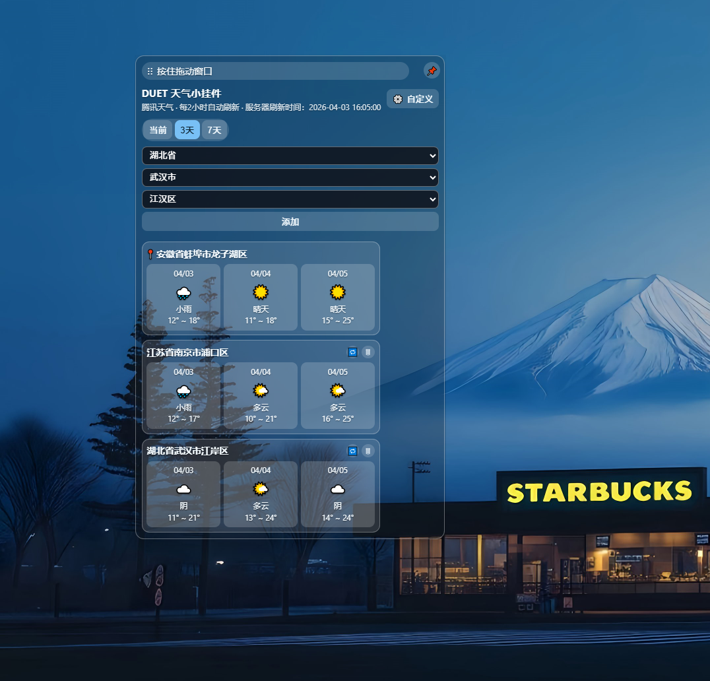
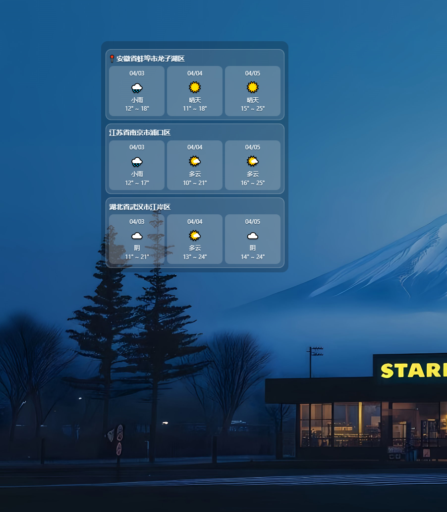

# Duet Desktop Weather




一个基于 Tauri + Preact + TypeScript 实现的 Windows 桌面天气挂件。

它的目标不是做一个传统窗口应用，而是尽量接近桌面小组件的使用体验：透明背景、无边框、任务栏隐藏、托盘驻留、支持固定在桌面底层，并且能够根据内容动态调整窗口尺寸，减少对桌面鼠标操作的干扰。

## 特性

- 透明无边框桌面天气挂件
- 支持当前位置天气与手动添加多个城市
- 支持 1 天、3 天、7 天天气展示
- 手动城市使用省 / 市 / 区三级选择，天气请求使用 6 位区县 adcode
- 支持同城市下切换其他区县
- 固定 / 解除固定切换，固定后展示更简洁
- 动态调整窗口宽高，尽量贴合内容区域
- 腾讯位置服务 + 腾讯天气服务
- 所有天气与定位请求均走 Rust 后端，避免前端跨域问题
- 支持导入配置文件、下载配置模板
- 支持按日期记录日志，并自动清理过期日志
- 系统托盘驻留，支持显示 / 隐藏窗口与退出
- 支持便携版 exe 构建，也支持 NSIS 安装包构建

## 技术栈

- Tauri v2
- Rust
- Preact
- TypeScript
- Vite

## 运行环境

建议环境：

- Node.js 20+
- Rust stable
- Windows 10 / 11
- 已安装 WebView2 Runtime

## 配置文件

程序使用根目录下的 app-config.json 作为运行时配置文件。

示例：

```json
{
  "qq_map_key": "您的腾讯WebService API Key",
  "enable_daily_log": true
}
```

字段说明：

- qq_map_key: 腾讯位置服务 / 天气服务使用的 WebService API Key
- enable_daily_log: 是否启用按日期落盘日志，true 为开启，false 为关闭

说明：

- 打包时会把当前 app-config.json 作为默认配置一起带入构建产物
- 运行时如果用户导入了新的配置，程序会优先使用用户导入后的配置文件
- 不建议把真实 Key 直接提交到公开仓库

## 开发启动

安装依赖：

```bash
npm install
```

启动开发模式：

```bash
npm run desktop:dev
```

开发模式下会：

- 启动 Vite 开发服务器
- 启动 Tauri 桌面窗口
- 自动打开 DevTools

## 构建

### 1. 便携版 exe

默认构建命令会生成免安装版本：

```bash
npm run desktop:build
```

或显式使用便携版命令：

```bash
npm run desktop:build:portable
```

输出路径：

```text
src-tauri/target/release/DuetDesktopWeather.exe
```

这个版本适合直接分发和本地使用，不需要安装。

### 2. NSIS 安装包

如果需要 setup 安装包：

```bash
npm run desktop:build:installer
```

输出路径通常为：

```text
src-tauri/target/release/bundle/nsis/
```

## 配置导入与模板下载

程序内置了配置管理能力：

- 导入配置：从本地选择 json 文件，导入后立即刷新定位与天气
- 下载模板：弹出保存对话框，生成可编辑的配置模板

模板文件内容如下：

```json
{
  "qq_map_key": "您的腾讯WebService API Key",
  "enable_daily_log": true
}
```

## 日志

启用日志后，程序会记录接口请求与响应的关键信息，日志按日期命名，并自动清理超过 3 天的旧日志。

常见日志目录：

- 开发运行时：项目根目录下的 logs
- 打包运行时：exe 同级目录下的 logs

## 项目结构

```text
.
├─ src/                    前端界面与交互逻辑
├─ src/data/               城市与省市区级联数据
├─ src-tauri/              Tauri / Rust 后端
├─ scripts/                数据生成脚本
├─ app-config.json         运行时配置
└─ package.json            前端与打包脚本
```

## 常用脚本

```bash
npm run desktop:dev
npm run build
npm run desktop:build
npm run desktop:build:portable
npm run desktop:build:installer
```

## 已实现的核心行为

- 天气请求默认每 2 小时自动刷新
- 导入配置后会即时重新验证 Key 并刷新天气
- 窗口支持固定到桌面底层与解除固定
- 固定状态下按钮悬浮显示，交互尽量不遮挡桌面
- 窗口会根据内容尺寸自动收缩 / 扩展

## 说明

当前版本主要面向 Windows 使用场景，项目配置与交互也以 Windows 桌面挂件体验为主。

